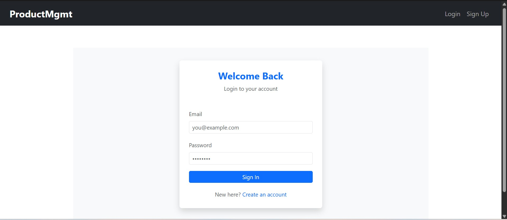
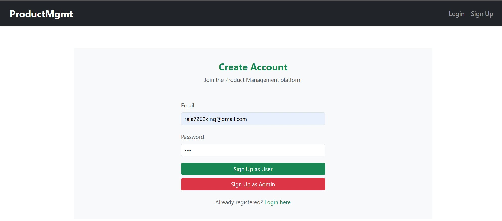
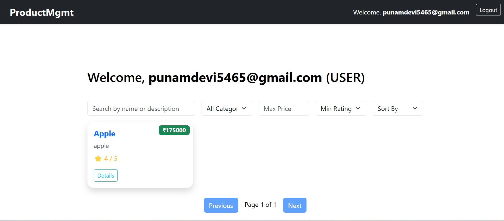
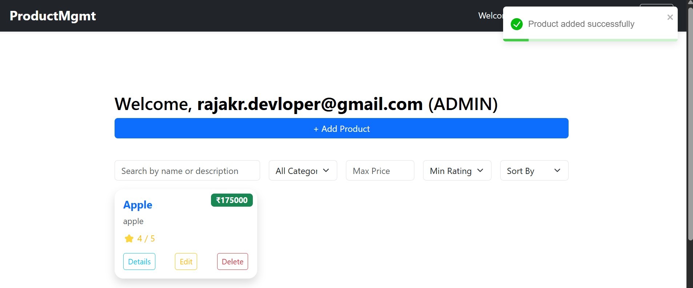

# 🌟 Product Management Web App

Welcome to the **Product Management Web App** — a feature-rich, modern full-stack application designed for managing products with role-based access. Built with **Spring Boot**, **React.js**, **JWT Authentication**, and PostgreSQL.


# 🚀 API Testing with Keploy – Assignment

## 👨‍💻 Task 1: API Testing with AI + CI/CD Integration

### ✅ Project Overview
A simple Express.js-based User and Task Management System API with endpoints to create, update, delete, and fetch users and tasks.

### 📁 Project Structure

```

├── --other--
├── package.json
├── swagger.yaml
├── keploy-config.yaml
└── .github
└── workflows
└── keploy.yml

```

### 🧪 Keploy Test Generation via CLI

- Installed Keploy CLI on WSL
- Ran the app with `keploy record --command "npm start"`
- Automatically generated test cases from live API usage
- Test data stored in `keploy/test-set` folder

### 🛠️ CI/CD Integration (GitHub Actions)

- Configured `keploy.yml` workflow for GitHub Actions
- Runs Keploy tests automatically on every push
- Ensures test coverage and API stability

### 📸 Keploy Test Dashboard Screenshot

[](https://postimg.cc/Z00BJdM2)

[](https://postimg.cc/1fq8qZPK)


---

## 🌐 Task 2: API Testing with Chrome Extension


### 🔧 Steps Followed

- Cloned Keploy Chrome Extension repo
- Loaded the extension via `chrome://extensions` → Developer Mode
- Started recording on the target websites
- Interacted with live pages to generate API traffic
- Used the **"Generate Tests"** button to auto-create test cases using Keploy AI

### 🖼️ Chrome Extension Screenshots

[](https://postimg.cc/3kjWtCk4)

---

---

## 💡 What I Learned

- Creating and using OpenAPI specs
- Recording API traffic to generate realistic test cases
- Using Keploy CLI + Chrome Extension effectively
- Integrating Keploy into CI/CD with GitHub Actions
- Speeding up API testing from hours to minutes using AI

---


## 🚀 Live Demo

🔗 **Frontend (Netlify)**: [https://projectmang.netlify.app](https://projectmang.netlify.app)  
🔗 **Backend (Render)**: [https://backend-server-1dgg.onrender.com](https://backend-server-1dgg.onrender.com)

---

## 🧠 Tech Stack

### 🔹 Frontend
- **React.js** with Hooks
- **React Router DOM** for routing
- **Bootstrap** for styling

### 🔹 Backend
- **Spring Boot 3.4.4**
- **Java 21**
- **Spring Security + JWT** for Authentication & Authorization
- **PostgreSQL** Database
- **JPA (Hibernate)** for ORM

---

## 🔐 Features

✅ User Signup & Login  
✅ JWT-Based Secure Authentication  
✅ Role-Based Access (Admin/User)  
✅ Product CRUD Operations (Admin Only)  
✅ Product Filtering, Searching & Sorting (Dashboard)  
✅ Image Upload for Products  
✅ Responsive UI with Bootstrap  

---

## 📸 Screenshots


### 🔐 Login Page


### 📝 Signup Page


### 📦 Product Dashboard


### ➕ Add/Edit Product (Admin only)


---

## 🧰 Project Setup

### 🖥️ Backend (Spring Boot)

#### 1. Clone the Repository:
```bash
git clone [https://github.com/https://github.com/raja2576/zynetic_22052576.git](https://github.com/raja2576/zynetic_22052576.git)
cd productManagementApp         --- -> Backend
cd zynetic_assignment_frontend  -----> Frontend
```

#### 2. Configure PostgreSQL
Update your `application.properties`:
```properties
spring.datasource.url=jdbc:postgresql://localhost:5432/your_db
spring.datasource.username=your_username
spring.datasource.password=your_password
```

#### 3. Run the App
```bash
./mvnw spring-boot:run
```

---

## 🧪 Testing Overview

Includes:

✔️ Unit Tests
✔️ Integration Tests
✔️ API Tests
✔️ Security Tests with JWT mocking

---

[](https://postimg.cc/yW8tqQfB)


## ✔️ Unit Tests (Service Layer)

**Location:** `src/test/java/com/kiit/productManagementApp/service`

| Method                   | Expected Output                        |
| ------------------------ | -------------------------------------- |
| `saveProduct(Product)`   | Returns saved product with ID          |
| `updateProduct(Product)` | Returns updated product details        |
| `hataoProduct(id)`       | Deletes product and verifies repo call |
| `filterByCategory()`     | Returns products filtered by category  |

---

## ✔️ Integration Tests (Controller Layer)

**Location:** `src/test/java/com/kiit/productManagementApp/controller`

### Covered Endpoints:

| Endpoint                           | Role       | Expected Output                     |
| ---------------------------------- | ---------- | ----------------------------------- |
| `POST /api/products/add`           | ADMIN      | 200 OK with saved product details   |
| `GET /api/products/all`            | USER/ADMIN | 200 OK with list of all products    |
| `DELETE /api/products/remove/{id}` | ADMIN      | 200 OK if deletion successful       |
| `PUT /api/products/modify`         | ADMIN      | 200 OK with updated product details |
| `GET /api/products/filter/...`     | USER/ADMIN | Filtered product list returned      |

---

## ✔️ API Testing with Postman

### Example: Login

```json
POST /api/auth/login  
{
  "email": "admin@example.com",
  "password": "admin123"
}
```

✅ Returns JWT token
❌ 401 Unauthorized if credentials invalid

### Example: Get Products (with Token)

```http
GET /api/products/all  
Authorization: Bearer <JWT_TOKEN>
```

✅ 200 OK with product list

---

## ✔️ Security Testing

* `@WithMockUser` used for role-based controller tests
* JWT token logic mocked during tests
* Unauthorized scenarios return `401 Unauthorized`

---

## 📊 Test Coverage Snapshot

You can generate coverage reports using:

```bash
mvn clean test jacoco:report
```

**Expected Coverage:**

* Service Layer: ✅ \~90%
* Controller Layer: ✅ 80-90%
* Repository Logic: ✅ via integration tests

---

## 📂 Project Structure

```
src
 ├── main
 │   ├── java/com/kiit/productManagementApp
 │   │   ├── controller    # REST Controllers
 │   │   ├── service       # Business logic
 │   │   ├── security      # JWT and Security Config
 │   │   ├── stores        # Repositories
 │   │   └── model         # Data Models
 └── test
     ├── java/com/kiit/productManagementApp
         ├── controller    # Controller Tests
         ├── service       # Service Layer Unit Tests
```


### 🌐 Frontend (React.js)

#### 1. Navigate to React Project:
```bash
cd zynetic_assignment_frontend
```

#### 2. Install Dependencies
```bash
npm install
```

#### 3. Build Project
```bash
npm run build
```

#### 4. Deploy to Netlify
```bash
netlify deploy --prod --dir=dist
```
> If using Vite, your build folder is `dist` not `build`

---

## 🌍 Deployment Notes

### 🔁 Keep Render Backend Awake (Optional for free tier)
To prevent your backend from sleeping on Render:
```js
useEffect(() => {
  const ping = () => {
    fetch('https://backend-server-1dgg.onrender.com/api/auth/ping')
      .then(() => console.log("Backend pinged"));
  };
  const interval = setInterval(ping, 270000); // every 4.5 minutes
  ping();
  return () => clearInterval(interval);
}, []);
```
> Added this Code to Keep the server alive (As i m working on free tier subscrpition)


---

````markdown
# 📦 Product Management App – API Documentation


This API supports user authentication, admin functionality, product management, and image serving.

---

## 🛡️ Authentication API – `/api/auth`

### 🔐 POST `/api/auth/signup`

Register a new **User** account.

#### Request Body
```json
{
  "email": "user@example.com",
  "password": "yourPassword"
}
````

#### Responses

* `200 OK` – Returns the created user.
* `409 Conflict` – If user already exists.

---

### 🔐 POST `/api/auth/admin/signup`

Register a new **Admin** account.

#### Request Body

```json
{
  "email": "admin@example.com",
  "password": "yourPassword"
}
```

#### Responses

* `200 OK` – Returns the created admin user.
* `409 Conflict` – If admin already exists.

---

### 🔐 POST `/api/auth/login`

Login as a user or admin.

#### Request Body

```json
{
  "email": "user@example.com",
  "password": "yourPassword"
}
```

#### Responses

* `200 OK`

```json
{
  "token": "JWT_TOKEN"
}
```

* `401 Unauthorized` – Invalid credentials.

---

## 🖼️ Image API – `/api/products/image`

### 🖼️ GET `/api/products/image/{filename}`

Serves an uploaded product image.

#### Path Parameter

* `filename`: Name of the file (e.g. `watch.jpg`)

#### Responses

* `200 OK` – Returns the image file.
* `404 Not Found` – If the file does not exist.

---

## 🛍️ Product API – `/api/products`

All endpoints below require **JWT authentication**.

---

### ➕ POST `/api/products/add`

Create a new product.
**Access**: `ADMIN` only

#### Request Body

```json
{
  "name": "Smartphone",
  "price": 599.99,
  "category": "Electronics",
  "rating": 4.5,
  "description": "High-end Android smartphone"
}
```

#### Response

* `200 OK` – Returns the created product.

---

### 📄 GET `/api/products/all`

Get a list of all products.
**Access**: `USER` or `ADMIN`

#### Response

* `200 OK` – List of product items.

---

### ❌ DELETE `/api/products/remove/{id}`

Delete a product by ID.
**Access**: `ADMIN` only

#### Path Parameter

* `id`: Product ID

#### Response

* `200 OK` – If deletion is successful.

---

### ✏️ PUT `/api/products/modify`

Update an existing product.
**Access**: `ADMIN` only

#### Request Body

Same format as POST `/add`

---

### 📦 GET `/api/products/filter/category`

Filter products by category.
**Access**: `USER` or `ADMIN`

#### Query Parameter

* `category`: e.g. `Electronics`

---

### 💸 GET `/api/products/filter/price`

Filter products by price range.
**Access**: `USER` or `ADMIN`

#### Query Parameters

* `min`: Minimum price
* `max`: Maximum price

---

### ⭐ GET `/api/products/filter/rating`

Filter products by rating.
**Access**: `USER` or `ADMIN`

#### Query Parameter

* `rate`: Minimum rating (e.g. `4.0`)

---

### 🔍 GET `/api/products/search`

Search products by keyword.
**Access**: `USER` or `ADMIN`

#### Query Parameter

* `text`: Keyword (e.g. `laptop`)

---

## 🔑 Authentication Summary

| Endpoint                       | Role Required   |
| ------------------------------ | --------------  |
| `POST /api/auth/signup`        | ❌ Public       |
| `POST /api/auth/admin/signup`  | ❌ Public       |
| `POST /api/auth/login`         | ❌ Public       |
| `POST /api/products/add`       | ✅ `ADMIN`      |
| `GET /api/products/all`        | ✅ `USER/ADMIN` |
| `DELETE /api/products/remove`  | ✅ `ADMIN`      |
| `PUT /api/products/modify`     | ✅ `ADMIN`      |
| `GET /api/products/filter/...` | ✅ `USER/ADMIN` |
| `GET /api/products/search`     | ✅ `USER/ADMIN` |

---

## 🧪 Testing Notes

Use tools like **Postman**, **Insomnia**, or cURL.

For protected routes, include the JWT token in the headers:

```
Authorization: Bearer YOUR_JWT_TOKEN
```

---

## 📁 File Uploads

Images should be stored in the `/uploads` directory. File retrieval is handled via:

```
GET /api/products/image/{filename}
```

---

## 👨‍💻 Built With

* Spring Boot
* Spring Security (JWT)
* Maven
* Java 17+

---


## 🧑‍💻 Author

Made with ❤️ by Raja 
Connect on [LinkedIn]([https://linkedin.com/in/your-profile](http://linkedin.com/in/raja-kumar-rana-a60715252))

---


